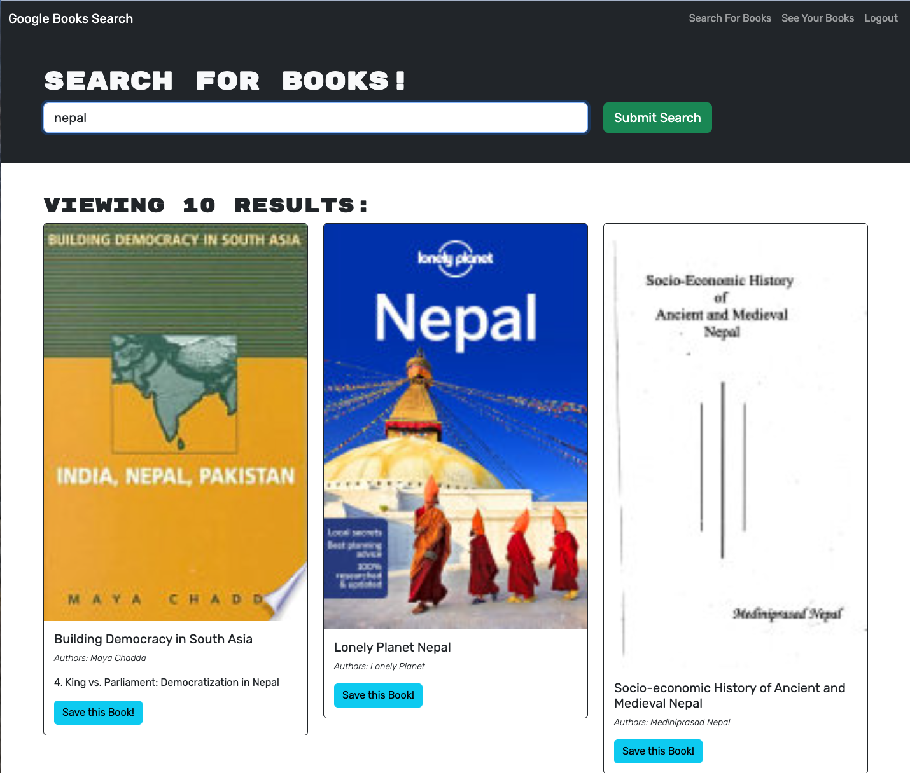
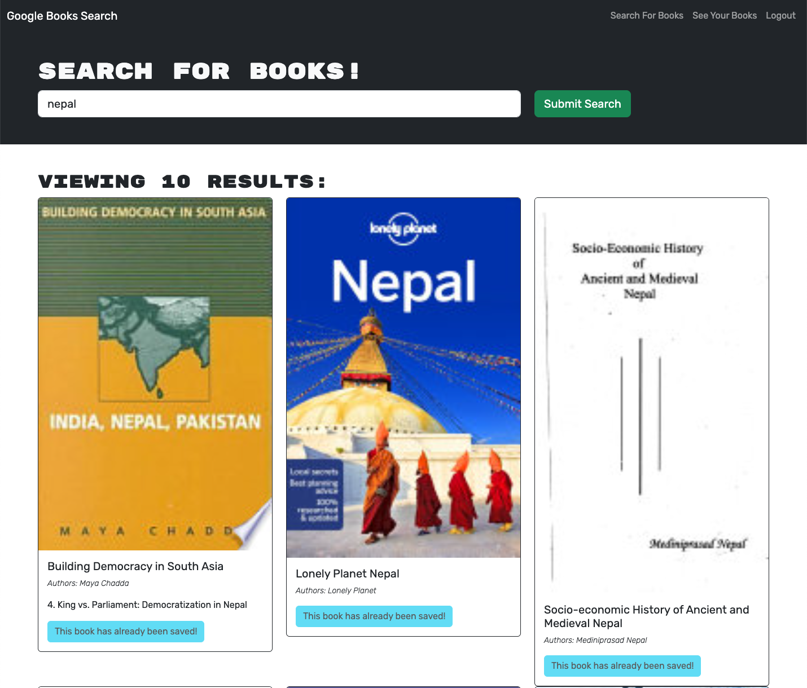
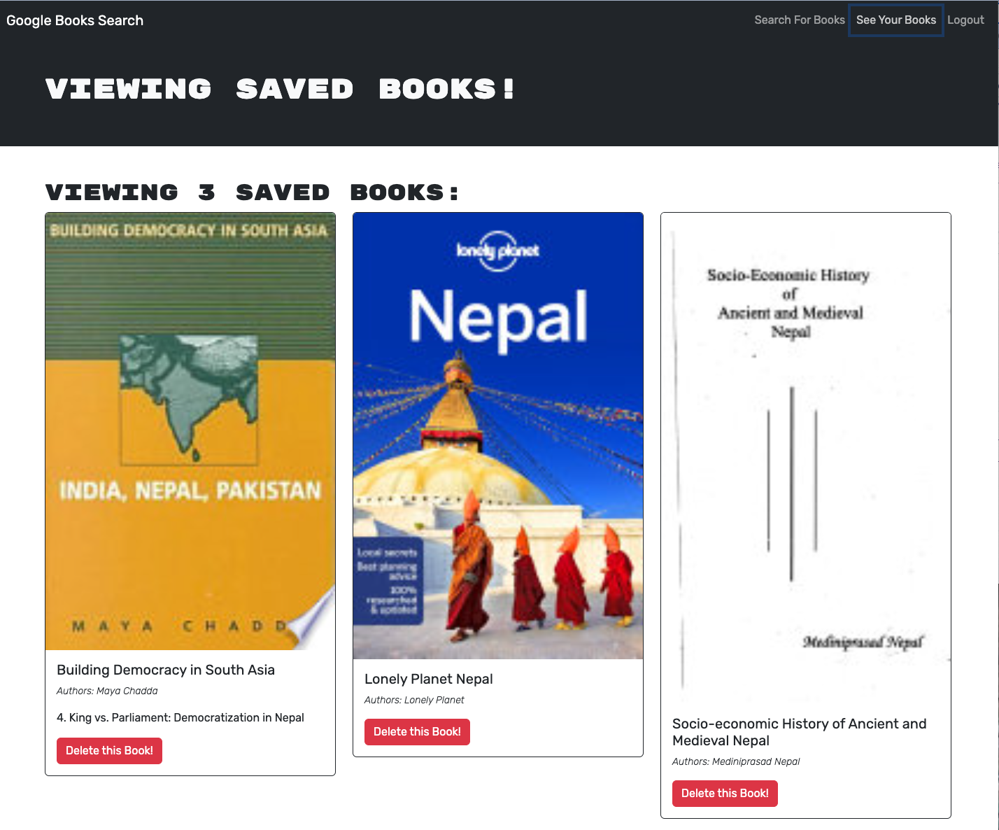

# SJ_MERN_BOOK_SEARCH-ENGINE

[](https://opensource.org/licenses/MIT)

## Description.

Fully functioning Google Books API search engine built with a RESTful API, and refactor it to be a GraphQL API built with Apollo Server. The app was built using the MERN stack, with a React front end, MongoDB database, and Node.js/Express.js server and API. It's already set up to allow users to save book searches to the back end.


## Table of Contents:
- [Overview](#Overview)
- [The Challenge](#The-Challenge)
- [Usage Information](#Usage-Information)
- [Installation Process](#Installation-Process)
- [Built With](#Built-With)
- [What I Learned](#What-I-Learned)
- [Continued Development](#Continued-Development)
- [License](#License)
- [Author](#Author)

# Overview

## The Challenge
The primary goal of this project is to develop a single-page application portfolio that highlights the expertise and capabilities of a web developer in constructing React applications. The key objectives for this project include:

1. Set up an Apollo Server to use GraphQL queries and mutations to fetch and modify data, replacing the existing RESTful API.
2. Modify the existing authentication middleware so that it works in the context of a GraphQL API.
3. Create an Apollo Provider so that requests can communicate with an Apollo Server.
4. Update Apollo caching to make worked.
5. Deploy the application to Heroku.

## Assigned User Story:
```
AS AN avid reader
I WANT to search for new books to read
SO THAT I can keep a list of books to purchase
```

## Acceptance Criteria:
```
GIVEN a book search engine
WHEN I load the search engine
THEN I am presented with a menu with the options Search for Books and Login/Signup and an input field to search for books and a submit button
WHEN I click on the Search for Books menu option
THEN I am presented with an input field to search for books and a submit button
WHEN I am not logged in and enter a search term in the input field and click the submit button
THEN I am presented with several search results, each featuring a book’s title, author, description, image, and a link to that book on the Google Books site
WHEN I click on the Login/Signup menu option
THEN a modal appears on the screen with a toggle between the option to log in or sign up
WHEN the toggle is set to Signup
THEN I am presented with three inputs for a username, an email address, and a password, and a signup button
WHEN the toggle is set to Login
THEN I am presented with two inputs for an email address and a password and login button
WHEN I enter a valid email address and create a password and click on the signup button
THEN my user account is created and I am logged in to the site
WHEN I enter my account’s email address and password and click on the login button
THEN I the modal closes and I am logged in to the site
WHEN I am logged in to the site
THEN the menu options change to Search for Books, an option to see my saved books, and Logout
WHEN I am logged in and enter a search term in the input field and click the submit button
THEN I am presented with several search results, each featuring a book’s title, author, description, image, and a link to that book on the Google Books site and a button to save a book to my account
WHEN I click on the Save button on a book
THEN that book’s information is saved to my account
WHEN I click on the option to see my saved books
THEN I am presented with all of the books I have saved to my account, each featuring the book’s title, author, description, image, and a link to that book on the Google Books site and a button to remove a book from my account
WHEN I click on the Remove button on a book
THEN that book is deleted from my saved books list
WHEN I click on the Logout button
THEN I am logged out of the site and presented with a menu with the options Search for Books and Login/Signup and an input field to search for books and a submit button  
```

## SJ MERN Book Search Engine GIF:
#### The following animation demonstrates the application functionality:


## Usage Instructions:
To access application
1. Go to [Deployed Application Link:](https://sj-mern-book-search-engine-33f260e10a90.herokuapp.com/) to access the application
2. Before logging in/setting up an account
    * search for books and observe the cards - you will not see any buttons to save the books
3. Log in or create an account (top right corner menu)
    * search for books and observe the cards - you will see "Save this Book!" button at the bottom of each card.
    * for books that you like, click on the button
4. Go to your Saved books (top right corner menu)
    * view your existing saved books; notice the red button at the bottom to "delete" book.
    * for books that you don't want, click on the "delete" button. Deleting a book will only remove it from your listing; it will not remove it from google.
5. Allow 2 hours pass by (max life of a token is 2 hours)
    *  attempt to either: access the ```/saved``` route, click on the "delete" button, or click on the "save book" button - you should be redirected to the main page and the login button will not be visible

## Deployed GitHub-Pages Application Link:
[Deployed GitHub-Pages Application Link:](https://sj-mern-book-search-engine-33f260e10a90.herokuapp.com/)

## GitHub Repository:
[GitHub Repository:](https://github.com/sonam-git/SJ_MERN_BOOK_SEARCH)


## Application Screenshot:
* Rendering Searched Books:



* Rendering Saving Books:



* Rendering Saved Books:




## Installation Process:
1. Clone the Repository from GitHub (or) Download Zip Folder from Repository from GitHub.
2. Open the cloned (or downloaded) repository in any source code editor.
3. Open the integrated terminal of the document and complete the respective installation guides provided in "Built With" to ensure the cloned documentation will operate.

## Built With:
- Dynamic JavaScript
- JSON: [JSON](https://www.npmjs.com/package/json)
- Mongoose: [7.0.3](https://www.npmjs.com/package/mongoose)
- Express: [4.18.2](https://www.npmjs.com/package/express)
- Node.js: [16.18.1](https://nodejs.org/en/blog/release/v16.18.1/)
- MongoDB: [Website](https://www.mongodb.com/)
- Nodemon: [2.0.12](https://www.npmjs.com/package/nodemon/v/2.0.12)
- GraphQL: [16.6.0](https://www.npmjs.com/package/graphql)
- JsonWebToken: [9.0.0](https://www.npmjs.com/package/jsonwebtoken)
- React: [18.2.0](https://www.npmjs.com/package/react)
- React-Dom: [18.2.0](https://www.npmjs.com/package/react-dom)
- JWT: [9.0.0](https://jwt.io)
- Heroku: [Website](https://www.heroku.com/platform)
- License Badge: [Shields.io](https://shields.io/)
- Visual Studio Code: [Website](https://code.visualstudio.com/)

## What I Learned:

### Comparision between RESTful API and GraphQL API
1. Data Structure:

* RESTful API: Resources are exposed as endpoints, and each endpoint represents a specific entity or collection of entities. Resources are accessed using standard HTTP methods such as GET, POST, PUT, and DELETE.

* GraphQL: GraphQL uses a single endpoint, and all data is requested and retrieved using a single POST request. The server exposes a schema that defines the available data and operations, and clients can request specific fields, relationships, and depth of data in their queries.

2. Data Fetching Control:

* RESTful API: Clients have limited control over the data they receive. Each endpoint returns a fixed set of data, and clients might end up over-fetching or under-fetching data.

* GraphQL: Clients have precise control over the data they receive. They can specify the fields they need in a query, avoiding over-fetching and under-fetching. This allows clients to reduce the number of round trips to the server and retrieve all required data in a single request.

3. Versioning:

* RESTful API: Versioning is often required to manage changes and backward compatibility. New versions of endpoints are introduced as APIs evolve to avoid breaking existing clients.

* GraphQL: GraphQL is designed to be backward-compatible by default. As the schema evolves, deprecated fields can be marked and phased out gradually, without requiring versioning. This makes the evolution of the API smoother.

4. Response Structure:

* RESTful API: RESTful APIs have fixed response structures defined by the server. Clients receive the entire response, regardless of whether they need all the included fields or not.

* GraphQL: The response structure in GraphQL matches the structure of the query requested by the client. Clients receive precisely the data they requested in the response, reducing unnecessary data transfer and improving efficiency.

5. Strong Typing and Introspection:

* RESTful API: RESTful APIs may use external documentation, but they lack built-in introspection capabilities. Clients often rely on external documentation or trial-and-error to understand available endpoints and data formats.

* GraphQL: GraphQL has a strong type system, and the schema acts as a contract between the server and clients. Clients can introspect the schema, access detailed documentation, and receive autocomplete suggestions, making it easier to understand and use the API.

6. Real-time Updates:

* RESTful API: RESTful APIs typically rely on separate mechanisms (e.g., WebSockets or polling) to provide real-time updates, which can add complexity to the implementation.

* GraphQL: GraphQL natively supports real-time updates through subscriptions. Clients can subscribe to specific data changes and receive updates whenever the subscribed data changes on the server, simplifying real-time data retrieval.

7. Learning Curve:

* RESTful API: RESTful APIs are well-established and straightforward to learn, as they follow the principles of HTTP and REST.

* GraphQL: GraphQL introduces a new query language and requires some additional infrastructure compared to RESTful APIs. This may result in a steeper learning curve and initial setup effort, but it offers more flexibility and efficiency in data retrieval for complex scenarios.

In summary, RESTful APIs are suitable for simple use cases where fixed endpoints and straightforward data retrieval are sufficient. GraphQL, on the other hand, is more suitable for complex scenarios where clients require precise control over data retrieval, real-time updates, and reduced network overhead. The choice between the two depends on the specific needs and complexity of your application.

### Continued Development:
1. Rewrite the typeDef for Save book query to use an input Type as opposed to using individual parameters 
2. Modify the image source to use either http or https depending on the host protocol. The Google API returns the image link as an http links. However, since the App is deployed to Heroku - which by default is https - a lot of warning messages get generated in the Chrome dev tools console about that the fact that a request is made to an http resource.
3. Add links for purchasing/downloading/viewing the books if such links exist
4. Convert to PWA


## License & Copyright ©
  
[](https://opensource.org/licenses/MIT) 


## Author

Follow me on Github at [Sonam J Sherpa](https://github.com/sonam-git). Additional questions or concerns? feel free to contact me [Sonam J Sherpa](sherpa.sjs@gmail.com).

### Copyright © 2023 [Sonam J Sherpa](https://github.com/sonam-git)

